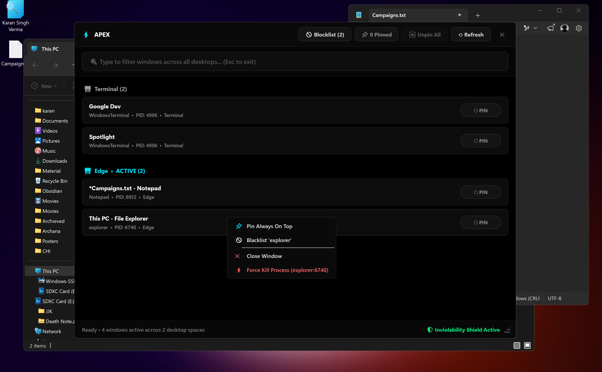
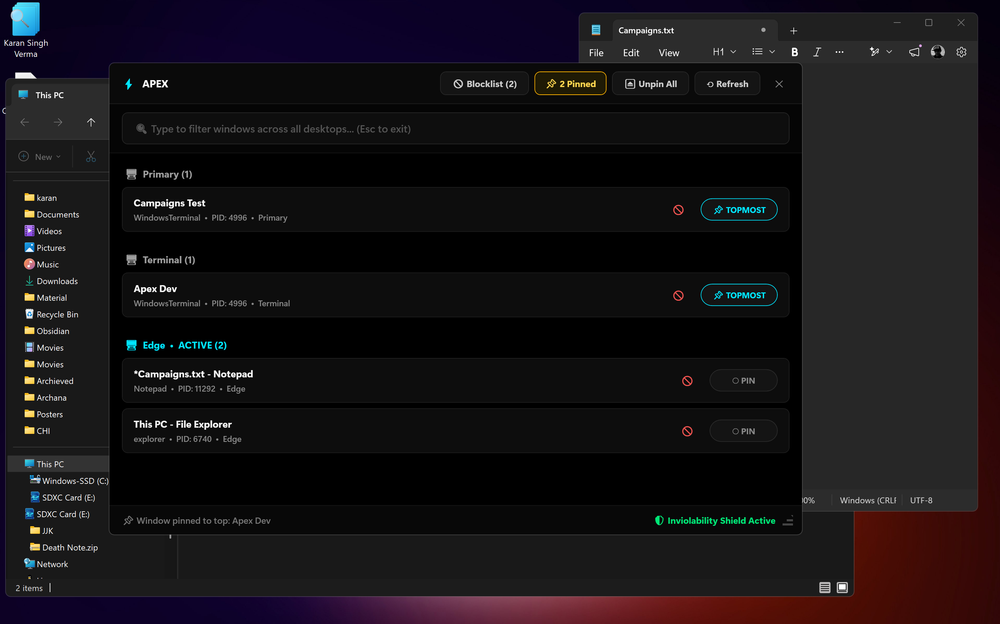
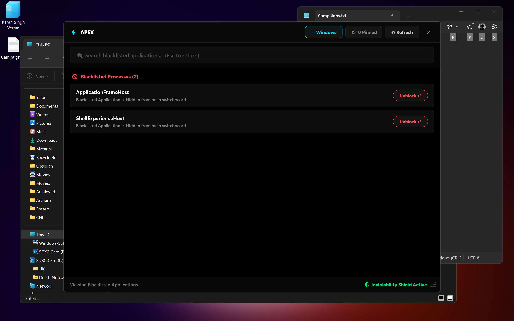

# ⚡ Apex

> **Module**: `Modules/Apex`  
> **Ecosystem**: Sakshi (साक्षी // The Witness) — Release 3 (`v3.0.0`)  
> **Role**: DirectX GPU-Accelerated Virtual Desktop & Z-Order (Topmost) Controller  
> **Binary**: `~/.local/bin/Apex.exe`  
> **Global Shortcut**: `Ctrl + Alt + A` (Native Windows Explorer, 0 MB Idle RAM)  

<p align="center">
  
</p>

<p align="center">
  <b>DirectX Hardware-Accelerated Virtual Desktop & Z-Order (Topmost) Controller for Windows 11</b><br>
  <i>Native .NET 9 • Zero Background Daemons • 0 MB Idle RAM • AMOLED Pitch Black (#000000)</i>
</p>

<p align="center">
  <a href="https://github.com/karansinghverma979/Apex/releases/latest"></a>
  
  
  
  
  <a href="https://github.com/karansinghverma979/Apex/releases/download/v2.0.0/Apex.exe"></a>
  
</p>

---

## 📸 Visual Showcase

### 1. Main Switchboard HUD & AMOLED Context Menu
*Streamlined minimal cards displaying only the Pin toggle, with active right-click AMOLED Context Menu for Pinning, Blacklisting, Graceful Close (`WM_CLOSE`), and Force Kill.*
<p align="center">
  
</p>

### 2. Live Topmost Pinning & Active Counters
*One-click depth toggling (`[○ PIN]` ⇄ `[📌 TOPMOST]`) with illuminated gold counter badge and zero focus stealing.*
<p align="center">
  
</p>

### 3. Application Blacklist Manager
*Permanent process exclusion management (`🚫 Blocklist`) to keep your workspace switchboard noise-free with instant unblocking.*
<p align="center">
  
</p>

---

## 🌟 Overview & Core Philosophy

**Apex** is a high-performance Windows 11 HUD designed for developers, researchers, and power users who juggle multiple Virtual Desktops and floating reference windows.

Most utilities (such as Microsoft PowerToys Always-On-Top) run heavy persistent background worker processes consuming **150 MB to 300 MB of RAM** and ongoing CPU cycles even when you aren't using them. 

Apex fundamentally rejects the daemon model:
- **Strictly 0 Background Daemons**: Apex exists **only when summoned**. When dismissed (`Esc` or `✕`), it terminates completely. **0% idle CPU, 0 MB idle RAM**.
- **Sub-50ms Cold Launch**: Built as a native single-file Windows subsystem binary (~328 KB) that cold-boots in **<50 milliseconds**.
- **Zero Screen Tearing at 120Hz+**: GPU-accelerated DirectX rendering pipeline built for high-refresh AMOLED/OLED displays.

---

## ⚡ Key Capabilities

* **🖥️ Native COM Virtual Desktop Discovery**: Reads the Windows Shell's internal `IVirtualDesktopManager` directly to identify real desktop spaces (`Primary`, `Terminal`, `Edge`, etc.) with dual CLSID negotiation supporting Windows 10, Windows 11 21H2–23H2, and Windows 11 24H2/25H2+.
* **📌 Focus-Safe Z-Order Control**: Pinning and unpinning operates via Win32 `SWP_NOACTIVATE | SWP_NOMOVE | SWP_NOSIZE | SWP_NOOWNERZORDER`. It will **never steal keyboard focus** or yank your viewport across desktops.
* **⚡ Single-Instance Teleportation**: Never opens duplicate windows. If summoned while already running on another desktop, Apex teleports to your active desktop, restores itself, and takes focus in <12ms.
* **⏏ One-Click Bulk Unpin**: The header's `[⏏ Unpin All]` button safely resets all user-pinned windows across all virtual desktops back to standard depth in a single stroke.
* **🛡️ System Inviolability Shield**: Hardcoded safeguard protecting system automation overlays (`MEMENTO MORI`, `Sakshi`) from accidental unpinning, closing, killing, or blacklisting.
* **✕ Graceful Close & ⚡ Force Kill (Right-Click Context Menu)**: Right-click any window card to summon an AMOLED context menu offering graceful window closure via asynchronous Win32 `WM_CLOSE` (`PostMessage`) or force process tree termination (`Process.Kill`) with desktop shell safeguards.
* **⏱️ 1-Minute Inactivity Auto-Kill (Self-Destruct)**: Built-in watchdog monitors intentional user interaction (keyboard keystrokes and mouse button clicks). If left idle for 60 seconds without intentional activity, Apex cleanly persists window geometry and terminates itself (`Application.Current.Shutdown()`), guaranteeing 0 lingering RAM or CPU. Passive mouse cursor moves and wheel scrolls are ignored.
* **🚫 Persistent Application Blacklist**: Hide noisy background windows (e.g., `ApplicationFrameHost`, `ShellExperienceHost`) via context menu. Persisted in `%LOCALAPPDATA%\Apex\blacklist.json`.
* **📐 Dynamic Geometry & Position Memory**: Freely resize via edges or the bottom-right grip. Automatically remembers window dimensions and screen coordinates across launches in `%LOCALAPPDATA%\Apex\window_config.json`.
* **🔍 Instant Multi-Field Filter**: Real-time search instantly filters across window titles, process names, and desktop spaces simultaneously.

---

## 🛠️ Technical Stack

| Domain | Technology | Implementation Details |
| :--- | :--- | :--- |
| **Runtime & Core** | **.NET 9.0** (`net9.0-windows`) | Modern C# 13, trimmed single-file compilation, zero-overhead hostfxr bootstrap |
| **UI Framework** | **WPF / XAML** | Hardware-accelerated DirectX pipeline, sub-pixel text rendering, native DPI awareness, AMOLED `#0A0A0A` context menus |
| **Windows Interop** | **Win32 P/Invoke** | `user32.dll` (`SetWindowPos`, `RegisterWindowMessage`, `EnumWindows`, `FlashWindowEx`, `PostMessage` `WM_CLOSE`) |
| **Window Styling** | **Desktop Window Manager (DWM)** | `dwmapi.dll` hardware-rounded corners (`DWMWA_WINDOW_CORNER_PREFERENCE = 33`) |
| **Virtual Desktops** | **COM Interface** | Dual-CLSID `IVirtualDesktopManager` (`AA509086...` / `AA509085...`) with `ImmersiveShell` fallback |
| **State Storage** | **`System.Text.Json`** | Low-allocation JSON serialization for blacklist and coordinate configs |
| **Deployment** | **Standalone Executable** | Self-contained single-file binary (~328 KB) deployed to `~/.local/bin/Apex.exe` |

---

## 🔬 Implementation Procedure (How It Works Under the Hood)

```text
┌────────────────────────────────────────────────────────┐
│                   APEX HUD (WPF / XAML)                │
│         DirectX 12 / DirectComposition 120Hz           │
└──────────────────────────┬─────────────────────────────┘
                           │
       ┌───────────────────┴───────────────────┐
       ▼                                       ▼
┌──────────────────────────────┐ ┌──────────────────────────────┐
│       CORE ENGINE (C# 13)    │ │      WIN32 / DWM INTEROP     │
│  - BlacklistManager          │ │  - SetWindowPos (Topmost)    │
│  - WindowConfig Persistence  │ │  - DwmSetWindowAttribute     │
│  - Filter & Card Cache       │ │  - RegisterWindowMessage     │
└──────────────┬───────────────┘ └──────────────┬───────────────┘
               │                                │
               └───────────────┬────────────────┘
                               ▼
┌────────────────────────────────────────────────────────┐
│             COM VIRTUAL DESKTOP MANAGER                │
│      IVirtualDesktopManager / ImmersiveShell           │
└────────────────────────────────────────────────────────┘
```

### 1. Dual-CLSID COM Virtual Desktop Resolution
Windows 11 24H2 altered internal COM GUIDs for virtual desktop services. Apex dynamically probes both modern (`AA509086...`) and legacy (`AA509085...`) CLSIDs via `IServiceProvider` on `ImmersiveShell`. For each enumerated window, it extracts the `DesktopId` and resolves friendly registry names from:
`HKCU\Software\Microsoft\Windows\CurrentVersion\Explorer\VirtualDesktops\Desktops\{GUID}\Name`.

### 2. Focus-Safe Z-Order Manipulation
To set or unset topmost status without interrupting the user's typing:
```csharp
SetWindowPos(
    hWnd, 
    isTopmost ? HWND_TOPMOST : HWND_NOTOPMOST, 
    0, 0, 0, 0, 
    SWP_NOMOVE | SWP_NOSIZE | SWP_NOACTIVATE | SWP_NOOWNERZORDER
);
```
Passing `SWP_NOACTIVATE` guarantees Windows will not transfer input focus or yank your screen to the pinned window.

### 3. Desktop Teleportation via Inter-Instance Broadcast
When Apex launches, it checks if an existing instance is running using a global mutex. If active:
1. The new process calls `RegisterWindowMessage("Apex_Summon_Message")` and broadcasts it to all top-level windows (`HWND_BROADCAST`).
2. The running instance catches the message in its `HwndSource` hook.
3. It retrieves the current active desktop ID via `VirtualDesktopHelper.GetCurrentDesktopId()`.
4. It calls `IVirtualDesktopManager.MoveWindowToDesktop(handle, currentDesktop)` and restores itself to the foreground.
5. The secondary process immediately exits (lifecycle: <15ms).

### 4. Precision Window Geometry Memory
Apex records dimensions and coordinates on `SizeChanged`, `LocationChanged`, `Deactivated`, and `Closing`:
- Coordinates are validated against `SystemParameters.VirtualScreen...` to prevent off-screen spawning if monitors were detached.
- Load order occurs strictly **after** `InitializeComponent()`, dynamically switching `WindowStartupLocation` to `Manual` when valid configs exist, or falling back to `CenterScreen`.

---

## ⌨️ Controls & Shortcuts

| Input | Action |
| :--- | :--- |
| **`Ctrl + Alt + A`** | Global hotkey to summon or teleport Apex (handled natively by Windows Shell, 0% CPU) |
| **`apex`** | Summon or teleport the Apex HUD from PowerShell, CMD, Git Bash, or WSL |
| **Click `[○ PIN]`** | Toggle window to Always-On-Top (`📌 TOPMOST`) without stealing focus |
| **Right-Click Card** | Summon AMOLED Context Menu: Pin/Unpin, Blacklist Process, Close Window, Force Kill |
| **Menu: `✕ Close Window`** | Graceful asynchronous `WM_CLOSE` to window handle with save prompts preserved |
| **Menu: `⚡ Force Kill`** | Force-terminate process tree (`Process.Kill`) with `explorer.exe` safeguard prompt |
| **`🚫 Blocklist` Tab** | Switch view to inspect and unblock blacklisted applications |
| **`Type to Filter`** | Real-time search across titles, processes, and virtual desktops |
| **`Esc`** | Exit Blocklist view, or dismiss and exit the HUD (terminates process) |
| **`F5` / `⟲ Refresh`** | Rescan virtual desktops and enumerate active windows |
| **`⏏ Unpin All`** | Reset all active user-pinned windows back to normal depth |
| **Drag Header** | Move the HUD anywhere across displays |
| **Drag Grip / Edges** | Resize HUD dimensions (automatically remembered for future launches) |

---

## 🚀 Installation & Quickstart

### 1. Automated Sakshi Module Deployment
From PowerShell within the repository or module directory:
```powershell
# Interactive deployment with immediate Explorer refresh
.\Install-Apex.ps1

# Silent deployment (non-interactive)
.\Install-Apex.ps1 -NonInteractive
```
* Compiles `Apex.exe` directly to `~/.local/bin/Apex.exe`.
* Registers the native Windows Explorer shortcut (`Ctrl+Alt+A`) in Start Menu.
* Zero background processes or daemons created.

### 2. Global Hotkey (`Ctrl + Alt + A`)
Apex registers a native Windows shortcut configured with `Hotkey = "Ctrl+Alt+A"`. Windows Explorer handles this shortcut natively with **zero background processes**. Press `Ctrl+Alt+A` on any virtual desktop to summon or teleport Apex.

### 3. Complete Uninstallation & Vanish
To completely vanish Apex with 0 residue:
```powershell
.\Uninstall-Apex.ps1
```

---

## 🏛️ Project Directory Structure

```
Apex/
├── .gitignore               # Strict build & artifact exclusions
├── AGENTS.md                # Agent operational invariants & architectural directives
├── README.md                # Comprehensive documentation & showcase
├── Release-1.md             # v1.0.0 baseline release dossier
├── Release-2.md             # v2.0.0 sovereign release dossier
├── Release-3.md             # Reserved future milestone placeholder
├── Apex.csproj              # .NET 9 project manifest (Single-file & icon configuration)
├── App.xaml / App.xaml.cs   # Application entrypoint & single-instance message broker
├── MainWindow.xaml          # AMOLED pitch-black UI markup & styles
├── MainWindow.xaml.cs       # View dispatcher, geometry memory & search engine
├── Assets/
│   ├── Apex.ico             # Multi-resolution application icon (16-256px)
│   ├── Apex.png             # Neon cyan pinnacle logo
│   ├── Apex-Main-HUD.png    # Screenshot: Main switchboard HUD
│   ├── Apex-Pinned-Active.png # Screenshot: Pinned active state
│   └── Apex-Blacklist-View.png # Screenshot: Process blacklist view
└── Core/
    ├── BlacklistManager.cs  # Local blacklist storage engine
    ├── VirtualDesktop.cs    # COM IVirtualDesktopManager interface & registry resolver
    ├── WindowItem.cs        # Observable window data model
    └── WindowManager.cs     # Win32 P/Invoke engine (SetWindowPos, DWM, FlashWindow)
```

---

## 📜 Documentation & Release Ledgers

* **Current Sovereign Specification**: See [`Release-2.md`](Release-2.md) for v2.0.0 features, AMOLED context menu, 1-minute auto-kill watchdog, and benchmarks.
* **Preceding Baseline Dossier**: See [`Release-1.md`](Release-1.md) for v1.0.0 foundation.
* **Future Milestone Placeholder**: See [`Release-3.md`](Release-3.md) for future milestone reservations.

---

## 🛡️ License

MIT License • Built with extreme discipline for high-velocity developer workflows.
