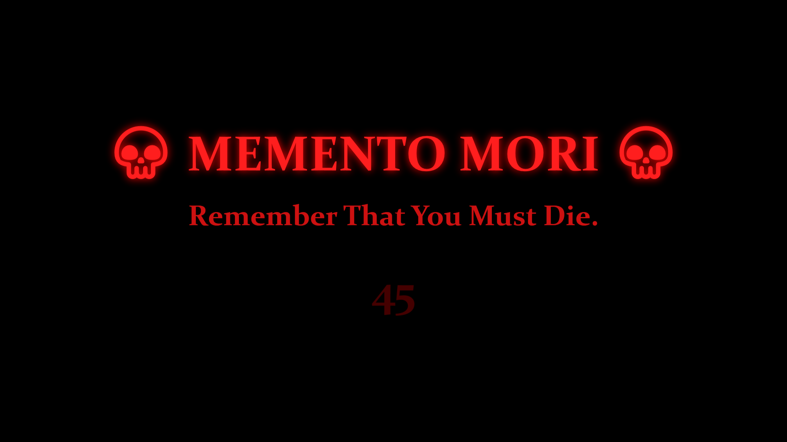
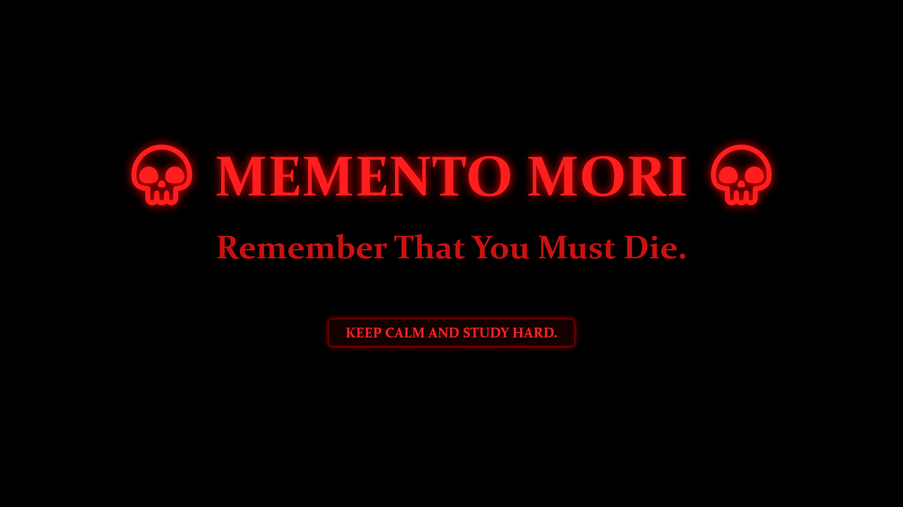

# 💀 Death (Memento Mori) Module

<p align="center">
  
  
  
  
  
</p>

---

> [!IMPORTANT]
> **"Memento Mori. Remember that you must die."**
> A sovereign, hardware-accelerated disciplinary enforcement engine within the **Sakshi** ecosystem. Engineered specifically for Windows 11, it eliminates digital distraction, tab paralysis, and procrastination through unescapable, high-velocity countdown lockdowns with **zero background daemon overhead**.

---

## 👁️ Visual Interface & Active States

### 1. The Active Countdown Lockdown
During the countdown phase, the screen is seized in pure `#000000` AMOLED OLED darkness. Ambient media is frozen, background apps are muted via WASAPI, and system escape shortcuts are intercepted by a low-level keyboard hook.

<p align="center">
  
</p>

* **Pulsating Typography**: `💀 MEMENTO MORI 💀` pulsating with a hardware-accelerated WPF drop-shadow glow (blur radius animated from 20 to 60).
* **Urgency Meter**: Central digital timer rendering remaining lockdown seconds in blood-red typography (`#FF2020`).
* **Mechanical PCM Audio**: In-memory synthesized dual-tone mechanical clock ticks (1800Hz / 1500Hz) reinforcing urgency.

---

### 2. Acknowledgment & Unlock State
Once the countdown hits zero, the mechanical ticking ceases, a resonant 1200Hz unlock chime fires, and the dynamic acknowledgment button fades into view with your personalized study quote.

<p align="center">
  
</p>

* **Quote Injection**: The motivational quote is manifested directly on the face of the acknowledgment button without disk file reading.
* **Release Protocol**: Clicking the acknowledgment button (or pressing Enter/Space) cleanly restores system audio, unhooks keyboard filters, saves state, and terminates the process—immediately returning memory to **0 MB**.

---

## 📐 System Architecture & Execution Lifecycle

The Death engine operates on a decoupled architecture where Windows Task Scheduler serves as the zero-RAM hardware clock:

```text
┌───────────────────────────────────────────────────────────┐
│              Windows Task Scheduler (Kernel Clock)        │
│  - Task Name: Death                                       │
│  - Interval: Configurable (e.g. 15, 20, 30, 45, 60m)      │
│  - Idle Footprint: 0 MB RAM / 0% CPU                      │
│  - Sleep Skip: StartWhenAvailable = $false (no wakeup lag)│
└─────────────────────────────┬─────────────────────────────┘
                              │ Scheduled repetition OR manual CLI `Death`
                              ▼
┌───────────────────────────────────────────────────────────┐
│             Death.exe (~/.local/bin/Death.exe)            │
│                                                           │
│  1. 4-Tier Media Freeze: Pauses YouTube, Spotify, VLC     │
│  2. WASAPI Audio Takeover: Low-level session mute         │
│  3. In-Memory PCM Synth: Calibrated 1800/1500Hz tick-tock │
│  4. DirectX OLED Lockdown: Topmost, borderless fullscreen │
│  5. Win32 LL Keyboard Hook: Suppresses escape shortcuts   │
│  6. Release: Resonant chime, quote unlock, unmute audio   │
└─────────────────────────────┬─────────────────────────────┘
                              │
                              ▼
              Process exits -> RAM drops back to 0 MB
```

---

## 🛡️ Overwatch Hardening & Escape Suppression

To ensure disciplinary integrity, the Death engine implements a multi-layer lockdown defense:

| Vector | Defense Mechanism | Technical Implementation |
| :--- | :--- | :--- |
| **Taskbar Close** | **Icon Eradication** | `ShowInTaskbar="False"` prevents the window from appearing on the Windows 11 taskbar, eliminating right-click "Close" or "End Task". |
| **System Hotkeys** | **Low-Level Keyboard Hook** | Win32 `SetWindowsHookEx(WH_KEYBOARD_LL)` intercepts and consumes `VK_LWIN`, `VK_RWIN`, `VK_TAB` (`Alt+Tab`), `VK_ESCAPE` (`Alt+F4`, `Ctrl+Esc`), and `VK_APPS`. Automatically unhooked upon unlock. |
| **Window Minimizing** | **State Enforcement** | `Window_StateChanged` overrides any attempt to minimize or restore down, immediately asserting `WindowState.Maximized`. |
| **Virtual Desktops** | **COM VDM Pinning** | Queries `IVirtualDesktopManager` to detect the currently active virtual desktop and pin/teleport the lockdown overlay immediately to the user's viewport. |
| **Foreground Lockout** | **Thread Input Attach** | Calls Win32 `AttachThreadInput` and `SetForegroundWindow` to bypass Windows foreground lock timeouts, guaranteeing top z-order. |

---

## 🔊 Audio Engine & Sound Synthesis

The audio subsystem (`AudioEngine.cs`) manages session audio without external audio dependencies:

1. **4-Tier Media Freeze**:
   - Primary: WinRT `GlobalSystemMediaTransportControlsSessionManager` (GSMTC) pausing browsers, Spotify, and media players.
   - Fallback 1: Win32 `WM_APPCOMMAND` (`APPCOMMAND_MEDIA_PAUSE`).
   - Fallback 2: Virtual key injection `VK_MEDIA_PLAY_PAUSE`.
   - Fallback 3: Focused `VK_SPACE` trigger.
2. **WASAPI Audio Isolation**:
   - Enumerates active Core Audio sessions via COM `IMMDeviceEnumerator` and `IAudioSessionManager2`.
   - Mutes third-party audio streams during the countdown while exempting `Death.exe`.
   - Restores pre-lockdown mute states immediately upon acknowledgment.
3. **In-Memory PCM Clock Synthesizer**:
   - Generates raw PCM wave streams in memory using high-frequency sine wave calculations.
   - Dual-tone ticking (1800Hz high tick, 1500Hz low tock) played via Win32 `PlaySound(SND_MEMORY | SND_ASYNC)`.
4. **Resonant Unlock Chime**:
   - Pure 1200Hz chime synthesizing a smooth bell decay over 450ms, signaling that the countdown is complete.

---

## 🚀 Installation & Deployment

Deploy the Death module using the automated installer:

```powershell
# Interactive installation (prompts for interval and quote)
.\Modules\Death\Install-Death.ps1

# Non-interactive silent installation
.\Modules\Death\Install-Death.ps1 -TaskName "Death" -IntervalMinutes 30 -Quote "KEEP CALM AND STUDY HARD." -NonInteractive
```

### Deployment Workflow:
1. **Validation**: Verifies .NET 9 SDK and target paths.
2. **PATH Setup**: Automatically appends `~/.local/bin` to User `PATH`.
3. **Compilation**: Publishes a single-file release binary (`Death.exe`) straight to `~/.local/bin/Death.exe`.
4. **Task Registration**: Configures Windows Task Scheduler with 0 MB idle RAM, 0% CPU, and Sleep-Skip (`StartWhenAvailable = $false`).
5. **Zero Disk I/O**: Injects the quote directly as a CLI argument (`--quote "..."`), requiring zero disk configuration files.

---

## 💻 CLI Usage Manual

With `~/.local/bin` in your `$env:PATH`, invoke the Death module anytime from any PowerShell or Command Prompt:

```powershell
# Display full CLI help manual
Death --help
Death -h

# Launch default 60-second countdown lockdown
Death

# Quick 3-second diagnostic smoke test
Death --test

# Launch with custom countdown duration (e.g. 15 seconds)
Death --seconds 15
Death -s 15

# Launch with dynamic custom study quote
Death --quote "DISCIPLINE EQUALS FREEDOM."
Death -q "FOCUS ON THE CURRENT TASK."
```

---

## 🧹 Deregistration & Uninstallation

To cleanly remove the scheduled task and binaries:

```powershell
# Complete eradication (removes task and deletes ~/.local/bin/Death.exe)
.\Modules\Death\Uninstall-Death.ps1

# Preserve compiled binary for manual CLI usage, removing only the schedule
.\Modules\Death\Uninstall-Death.ps1 -KeepBinary
```
