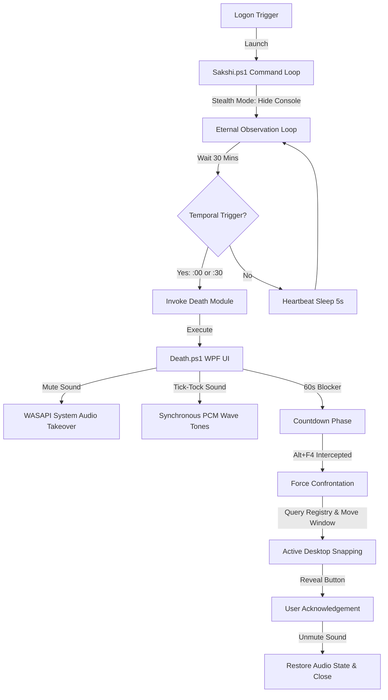

# <p align="center"><span style="color:#FF3333">👁️ SAKSHI // THE WITNESS v3.0</span></p>

<p align="center">
  
  
  
  
</p>

---

> [!IMPORTANT]
> **"Memento Mori. Remember that you must die."**
> Sakshi is a cold, logical, and absolute behavior-enforcement daemon designed to run silently on your machine. Its purpose is simple: to counter cognitive entropy, procrastination, and the wasting of digital potential. It treats the human user as fallible, and the system as the absolute enforcer of temporal discipline.

---

## 👁️ System Architecture & Workflow

Sakshi operates on a decoupled command-and-control design. The central command coordinates the timeline, while dedicated payload modules execute behavioral interventions.



---

## 🛠️ Technology Stack & Mechanisms

Sakshi is built natively on Windows system interfaces, utilizing the following core technologies:

| Category | Component | Description |
| :--- | :--- | :--- |
| **GUI Framework** | **WPF (XAML)** | Modeless WPF window execution loop managed by a custom `DispatcherFrame` thread message pump. Renders drop-shadow glow effect animations and pulse storyboards. |
| **Audio Takeover** | **WASAPI COM API** | Direct interfaces to Windows Core Audio endpoints. Dynamically queries, mutes, and unmutes application sessions without touching the master volume. |
| **Sound Synthesis** | **Win32 Multimedia** | Dynamically synthesizes pure sine wave PCM WAV streams in memory and plays them through the default sound card via native `winmm.dll` bindings. |
| **Anti-Bypass Lock** | **COM Desktop Manager** | Uses `IVirtualDesktopManager` COM interface and Windows registry query (`HKCU:\SOFTWARE\...\VirtualDesktops`) to track active desktops and move the window dynamically. |
| **Execution Loop** | **PowerShell Core / 5.1** | Lightweight script host executing coordinates and schedules without external dependencies. |

---

## 🧠 Components Detail

### 1. The Core Daemon: [Sakshi.ps1](file:///C:/Users/karan/Void/Sakshi/Sakshi.ps1)
*   **Stealth Initialization**: Immediately invokes Win32 `ShowWindow` via pinvoke to hide its own console window, running silently in the background:
    ```powershell
    $window::ShowWindow((Get-Process -Id $PID).MainWindowHandle, 0)
    ```
*   **Observer Loop**: Runs an infinite loop checking system time every 5 seconds.
*   **Intervention Intervals**: Dispatches the blocking *Death* payload exactly on the hour (`:00`) and the half-hour (`:30`).

### 2. The Payload: [Modules/Death/Death.ps1](file:///C:/Users/karan/Void/Sakshi/Modules/Death/Death.ps1)
The primary behavioral interceptor. When triggered, it locks down focus:

*   **WASAPI Audio Mute Takeover**: Enumerates all active audio sessions on the current rendering endpoint. It ignores system alert sounds and the script's own process, but silences browsers (Edge, Chrome), media players (Windows Media Player), games, and music players.
*   **PCM WAV Synthesizer**: Generates tick-tock mechanical sound effects at `1800Hz` and `1500Hz` directly into a memory buffer and plays them natively to bypass disabled PC speaker beep drivers:
    ```csharp
    [DllImport("winmm.dll", SetLastError = true, CharSet = CharSet.Auto)]
    public static extern bool PlaySound(byte[] pszSound, IntPtr hmod, uint fdwSound);
    ```
*   **Active Desktop Snapping**: Periodically reads the active virtual desktop Guid from the registry and uses `IVirtualDesktopManager` to move the window. If the user attempts to escape by switching desktops, the window instantly snaps onto the new active desktop:
    ```csharp
    _desktopManager.MoveWindowToDesktop(hWnd, ref currentDesktopGuid);
    ```
*   **Focus Lockdown**: Intercepts `Alt + F4`, window deactivation, and cursor escapes. The close button is hidden and disabled until the 60-second countdown finishes.
*   **Winding-Down Chimes**: Plays a three-tone rising chime (`1000Hz` $\rightarrow$ `1200Hz` $\rightarrow$ `1500Hz`) signaling completion, fades in the acknowledgement button, and cleanly restores all muted application volumes.

---

## 🎨 WPF Visual Interface Specs

> [!TIP]
> The lockdown window uses rich aesthetics designed to command attention and feel premium:
*   **Deep Dark Backdrop**: Pure `#000000` solid background with a blurry, semi-transparent (`Opacity="0.25"`) overlay that rotates randomized visual slides from the `Visuals/` directory.
*   **Drop-Shadow Header Glow**: Pulsating red typography (`💀MEMENTO MORI💀`) driven by a Storyboard animation shifting the blur radius between `20` and `60` dynamically.
*   **Urgency Display**: Center-staged timer fading from dark maroon to blood red as the clock winds down.
*   **Glow Button Style**: Fades in a custom drop-shadow button featuring your personalized study quote.

---

## ⚙️ Deployment & Clean Teardown

Sakshi is fully portable. All paths are resolved dynamically at runtime using `$PSScriptRoot`.

### 🚀 Installation
1. Search for **PowerShell** in the Start Menu, right-click, and select **Run as Administrator**.
2. Run the deployment script:
   ```powershell
   cd C:\Users\karan\Void\Sakshi
   .\Install-Service.ps1
   ```
3. Enter a custom Scheduled Task name or press `Enter` to use the default **`Sakshi`**.
4. Enter your personalized study quote (e.g. *"STUDY OR DIE."*). This quote will overwrite the default *"KEEP CALM..."* quote and appear on the confirmation button.
5. The script stops existing instances, creates a Scheduled Task configured to run on Logon with highest privileges, overrides battery restrictions, and triggers the observer loop immediately.

### 🧹 Uninstallation
To completely stop the daemon and wipe its footprint from the system task list:
1. Open **PowerShell** as **Administrator**.
2. Run the cleanup script:
   ```powershell
   cd C:\Users\karan\Void\Sakshi
   .\Uninstall-Service.ps1
   ```
3. Enter the scheduled task name to remove (press `Enter` to use **`Sakshi`**).
4. The script will stop the background observer and unregister the task cleanly.

---

## 🧬 Git Configuration

The repository is configured to exclude temporary files, telemetry logs, and diagnostic files. To publish the repository:

```bash
# Initialize and link to GitHub
git init
git remote add origin git@github.com:karansinghverma979/Sakshi.git

# Stage and commit clean files
git add .
git commit -m "Initialize Genesis Overwatch Daemon v3.0"

# Push to primary branch
git branch -M main
git push -u origin main
```

---

*   **Architect:** Karan Singh Verma
*   **System Version:** 3.0.0 (Production Build)
