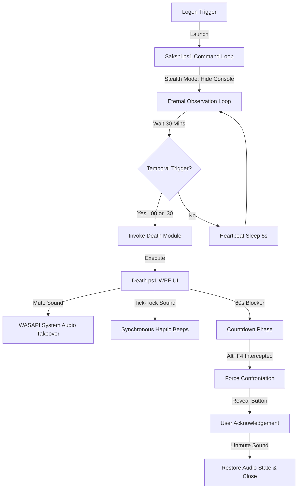

# <p align="center"><span style="color:#FF3333">SAKSHI // THE WITNESS</span></p>

<p align="center">
  
  
  
</p>

---

> **"The Witness sees all. The Witness does not judge. The Witness records. Remember that you must die."**

**SAKSHI** (Sanskrit: *The Observer / The Witness*) is a cold, logical, and absolute behavior-enforcement daemon designed to run silently on your machine. Its purpose is simple: to counter cognitive entropy, procrastination, and the wasting of digital potential. 

It implements a **Zero-Trust Accountability Framework**: it treats the human user as fallible, and the system as the absolute enforcer of temporal discipline.

---

## 👁️ System Architecture & Workflow

Sakshi operates on a decoupled command-and-control design. The central command coordinates the timeline, while dedicated payload modules execute behavioral interventions.



---

## 🛠️ Components

### 🧠 The Core Daemon: [Sakshi.ps1](file:///C:/Users/karan/Void/Sakshi/Sakshi.ps1)
*   **Role:** Background Coordinator & Process Scheduler.
*   **Vector:** Launched at user logon, running silently as a background process.
*   **Mechanism:** Runs an infinite observation loop with a 5-second heartbeat timer. It monitors the host system's time and dispatches payload scripts.
*   **Interval:** Triggers the *Death* module exactly on the hour (`:00`) and the half-hour (`:30`).

### 💀 The Payload: [Modules/Death/Death.ps1](file:///C:/Users/karan/Void/Sakshi/Modules/Death/Death.ps1)
The primary behavioral interceptor. When triggered, it locks down focus:
1.  **Direct Audio Takeover:** Interaces directly with Windows WASAPI to query your system's master volume state, then forces system-wide mute (stopping music/videos) during the timer.
2.  **Visual Lockdown:** Displays a topmost, full-screen visual blocker with customized drop-shadow glow effect animations.
3.  **Auditory Pressure:** Emits high-frequency mechanical tick-tock haptic tones directly through hardware console beep calls (`1800Hz` / `1500Hz`) to enforce urgency.
4.  **Bypass Blocked:** Intercepts `Alt + F4` and window closure events, locking the screen until the 60-second countdown runs out.
5.  **Clean Release:** Restores the system's original volume state only after the user acknowledges their focus and exits.

---

## ⚙️ Installation & Portability

Sakshi is fully portable. All paths are resolved dynamically at runtime using `$PSScriptRoot`. It can be cloned and deployed directly from any directory.

### Phase 1: Heart Stop (If upgrading/updating)
If you already have Sakshi registered, stop the running task before making changes:
```powershell
Stop-ScheduledTask -TaskName "Sakshi"
```

### Phase 2: Deploy & Register
1. Open **PowerShell** as **Administrator**.
2. Run the relative installation script:
   ```powershell
   cd C:\Users\karan\Void\Sakshi
   .\Install-Service.ps1
   ```
3. The installer will prompt you to name the Scheduled Task (press `Enter` to use the default name **`Sakshi`**).
4. The system will register the task under your active user session, bypass battery restrictions, enable a 1-minute automatic restart on failure, and launch the service immediately.

### Phase 3: Uninstallation (Clean Teardown)
To completely stop the daemon and remove its Scheduled Task registry:
1. Open **PowerShell** as **Administrator**.
2. Run the de-registration script:
   ```powershell
   cd C:\Users\karan\Void\Sakshi
   .\Uninstall-Service.ps1
   ```
3. Enter the name of the Scheduled Task to delete (press `Enter` to use the default name **`Sakshi`**).
4. The script will safely stop the active loop and remove it from your system task scheduler.

---

## 🧬 Git Configuration

The repository is configured to exclude temporary files, telemetry logs, and diagnostic files. To publish the repository:

```bash
# Initialize and link to GitHub
git init
git remote add origin git@github.com:karansinghverma979/Sakshi.git

# Stage and commit clean files
git add .
git commit -m "Initialize Genesis Overwatch Daemon v2.0"

# Push to primary branch
git branch -M main
git push -u origin main
```

---

*Architect: Karan Singh Verma*  
*System Version: 2.0.0 (Core Refined)*
